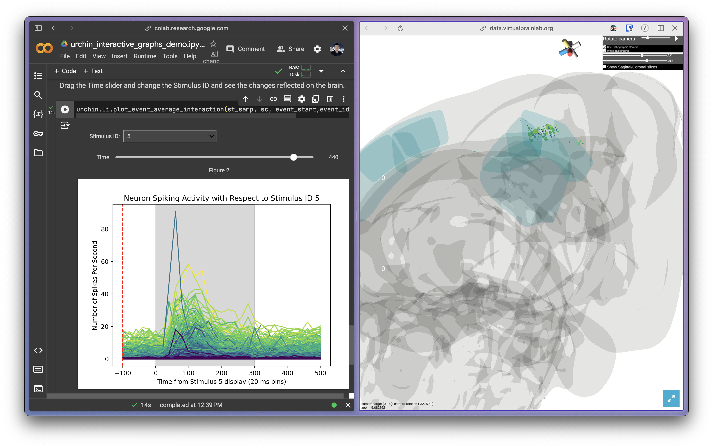

> Replay an electrophysiology experiment and explore data found at insertions.

Project by [Jasmine Schoch][jas] and [Kenneth Yang][ken] based on their work in the [Virtual Brain Lab][vbl] (VBL) group, part of the [Steinmetz Lab][ste].

# Background

One method of gathering brain activity data in neuroscience is known as acute *in vivo* electrophysiology. This is the technique of inserting silicon tip electrode probes into the brain and reading the electrical signals in the brain. In the [Virtual Brain Lab][vbl] group we develop software to assist scientists in visualizing, planning, and automating these experiments.

We are working with experimental data from research conducted in the [Steinmetz Lab][ste]. We work with mice and study visual cognition. A typical experiment will consist of showing some visual stimulus to the subject and recording the electrical activity from the neurons in various regions of interest (typically in the visual cortices).

This project is interested in taking the dense electrical signal data from experiments (often involving several insertions) and creating an interactive visualization that will allow users to explore, simulate, and replay the experiment. This will both let scientists gain better insight into the data gathered from the experiment and also let others learn about what data can be found by inserting probes at certain locations.

# Prototype

*On the left is the notebook which will let you load your experiment data and scrub through it. On the right is Urchin, the 3D interactive mouse brain. The highlighted region is VISp, the primary visual cortex. The small cubes are the neurons in the data.*

For our prototype, we are proofing out loading the spiking data from an electrophysiology experiment, replaying it (scrubbing through time), and projecting the neurons onto a 3D interactive visualization of the brain.

This is built using the application [Urchin](https://virtualbrainlab.org/urchin/installation_and_use.html) ([Jasmine's][jas] project in the VBL group).

Open the notebook below and run the cells to view the result!

Notes:

- The first dependency install step will require you to restart the session. Restart it when prompted.
- Urchin opens the 3D interactive visualization in a separate tab. If popups are blocked then a window won't open. You can open the renderer manually at `https://data.virtualbrainlab.org/Urchin/?ID=[insert id printed]`.
- To navigate the 3D visualization
    - Press and drag the left mouse button to orbit
    - Press and drag the right mouse button to pan
    - Scroll to zoom

## Next steps:

- Integrate [Pinpoint](https://virtualbrainlab.org/pinpoint/installation_and_use.html) ([Kenneth's][ken] project in the VBL group) which lets you insert virtual electrode probes and view the anatomical structures it will pass through.
- Filter experiment data based on insertion location.

<!-- Reused links -->
[jas]: mailto:jschoch@uw.edu
[ken]: mailto:kjy5@uw.edu
[vbl]: https://virtualbrainlab.org/
[ste]: https://www.steinmetzlab.net/